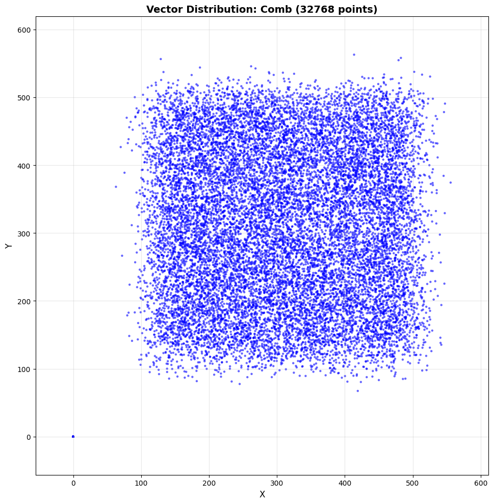

## Instructions

installation [instructions for AL2023](https://developer.arm.com/documentation/102620/2601/Installation). Install pre-build binaries for Arm Performance Libraries on your system with [the install guide](https://learn.arm.com/install-guides/armpl/).

```bash
sudo dnf config-manager --add-repo https://developer.arm.com/packages/arm-toolchains:amzn-2023/al2023/arm-toolchains:amzn-2023.repo
sudo dnf install arm-performance-libraries
sudo dnf install environment-modules

# If you want to add the module path next time you open a bash shell and you may need to restart the shell
echo 'export MODULEPATH=$MODULEPATH:/opt/arm/modulefiles' >> ~/.bashrc
module load <arm-performance-libs-name>
```

```bash
# environment variables should be available
echo $ARMPL_DIR
```

### Install Prerequisite Packages

```bash
sudo dnf update
sudo dnf install git cmake g++ environment-modules -y 
```

Installation [instructions for AL2023](https://developer.arm.com/documentation/102620/2601/Installation). Install pre-build binaries for Arm Performance Libraries on your system with [the install guide](https://learn.arm.com/install-guides/armpl/).


Build and Run baseline implementation using std::mt19337

```bash
cmake -S . -B build
cmake --build build/ --target main
```

```bash
./build/src/main
```

### Visualize data

```bash
cmake -S . -B build -DBUILD_TESTS=1
cmake --build build/ --target generate_visualization_baseline
```

```bash
./build/tests/generate_visualization_baseline
```

Need Python3 installed.
```bash
python3 --version
# Python 3.9.25
```

```bash
python3 -m venv venv
source venv/bin/activate
pip3 install -r scripts/requirements.txt
python3 scripts/visualize_vectors.py
```



## Accelerate with APL

```bash
make clean
cmake -S . -B build -DUSE_APL=1
cmake --build build --target main_with_apl
```

```bash
./build/src/main_with_apl
```

Need to pass environment variable through the command line tool. 

```bash
./apx recipe run code_hotspots --workload "<path_to_bin>" --target ATP-AWS-LINUX-2 --env LD_LIBRARY_PATH=</opt/arm/arm-performance-libraries/lib>
```

or add to `~/.bashrc` file. 

```bash
echo "export LD_LIBRARY_PATH=/opt/arm/arm-performance-libraries/lib:$LD_LIBRARY_PATH" > ~/.bashrc
```

Run the code hotspot recipe. 

## Microbenchmark Generating Distributions

```bash
make clean
cmake -S . -B build -DBUILD_TESTS=1
cmake --build build --target sweep_microbench_baseline
```

```output
./build/tests/sweep_microbench_baseline 
Generating Distribution of size 256 = 983 us
Generating Distribution of size 512 = 1827 us
Generating Distribution of size 1024 = 3701 us
Generating Distribution of size 2048 = 7301 us
Generating Distribution of size 4096 = 14678 us
Generating Distribution of size 8192 = 29260 us
Generating Distribution of size 16384 = 58855 us
Generating Distribution of size 32768 = 117070 us
```


```bash
make clean
cmake -S . -B build -DBUILD_TESTS=1 -DUSE_APL=1
cmake --build build --target sweep_microbench_with_apl
```
```output
./build/tests/sweep_microbench_with_apl 
Generating Distribution of size 256 = 57 us
Generating Distribution of size 512 = 59 us
Generating Distribution of size 1024 = 97 us
Generating Distribution of size 2048 = 187 us
Generating Distribution of size 4096 = 382 us
Generating Distribution of size 8192 = 732 us
Generating Distribution of size 16384 = 1503 us
Generating Distribution of size 32768 = 2973 us
```


## Build Debug Version of OpenRNG

git clone https://gitlab.arm.com/libraries/openrng.git

```bash
g++ --std=c++20 -g -O0 \
  src/main.cpp src/vec1d.cpp src/point.cpp src/rectangle.cpp src/export_data.cpp \
  -DUSE_ARMPL=1 \
  -I./include \
  -I./openrng/install/include \
  -I${ARMPL_DIR}/include \
  -L./openrng/install/lib64 \
  -L${ARMPL_DIR}/lib \
  -lopenrng -lamath -lm \
  -Wl,-rpath,$PWD/openrng/install/lib64 \
  -Wl,-rpath,${ARMPL_DIR}/lib \
  -o ./build/debug_openrng
```

